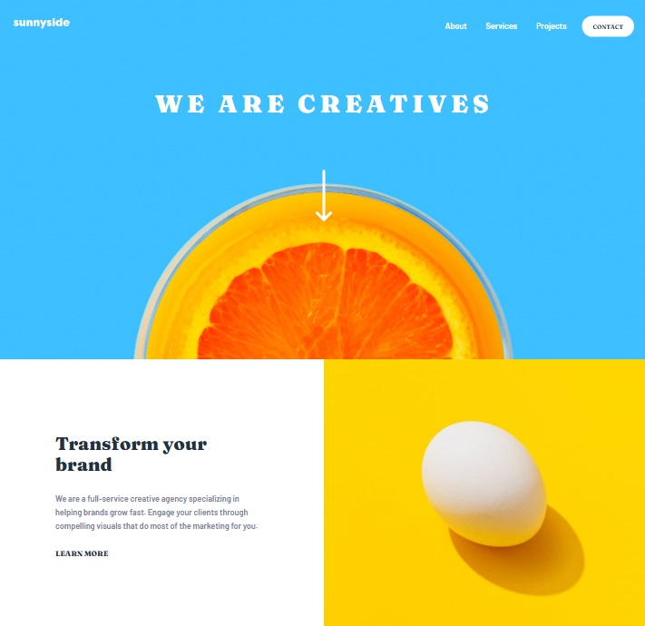
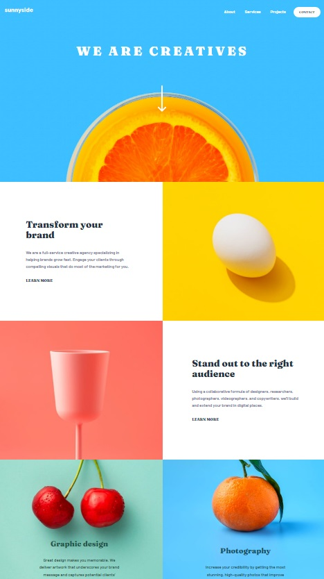
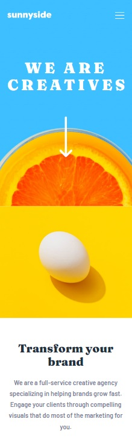

# Frontend Mentor - Sunnyside agency landing page solution

This is a solution to the [Sunnyside agency landing page challenge on Frontend Mentor](https://www.frontendmentor.io/challenges/sunnyside-agency-landing-page-7yVs3B6ef). Frontend Mentor challenges help you improve your coding skills by building realistic projects.

- An agency landing page responsive to desktop and mobile viewports. The page also has a  mobile navigation toggle which is a collapsible menu for mobile users.

## Table of contents

- [Overview](#overview)
  - [The challenge](#the-challenge)
  - [Screenshots](#screenshots)
  - [Links](#links)
- [My process](#my-process)
  - [Built with](#built-with)
- [Author](#author)

## Overview

### The challenge

Users should be able to:

- View the optimal layout for the site depending on their device's screen size
- See hover states for all interactive elements on the page

### Screenshots

  
  
  

### Links

- Solution URL: [Git repository](https://github.com/GozdeHisarckllar/challenge-sunnyside-agency-landing-page)
- Live Site URL: [Git Pages](https://gozdehisarckllar.github.io/challenge-sunnyside-agency-landing-page/)

## My process

### Built with

- Semantic HTML5 markup
- CSS3
- Flexbox
- CSS Grid
- Mobile-first workflow
- JavaScript

* I made both the layout and the images responsive to desktop and mobile viewports.

* I preferred the height of the background image in the header section to be equal to 100% of the viewport's height. Then, I added interactivity to the arrow SVG element in order to direct user to the main content.

* Besides the main requirements of the challenge, I also added some extra hover effects to the navigation links and an transition effect to the mobile navigation toggle menu.

## Author

- Github - [Gözde Hisarcıklılar](https://github.com/GozdeHisarckllar)
- Twitter - [@gzdehsr](https://www.twitter.com/gzdehsr)
